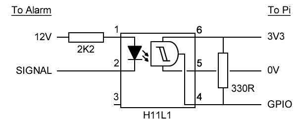

# Pi Alarm

Monitoring an ADE Honeywell Accenta Mini Gen4 alarm system using the Remote Signalling Input and Outputs (although I have yet to find an input...). 

The Accenta uses 4 Remote Signalling outputs for use with eg a speech dialer. These are connected to the Raspberry Pi's GPIO pins via Schmitt trigger isolators.

## Circuit diagram:

